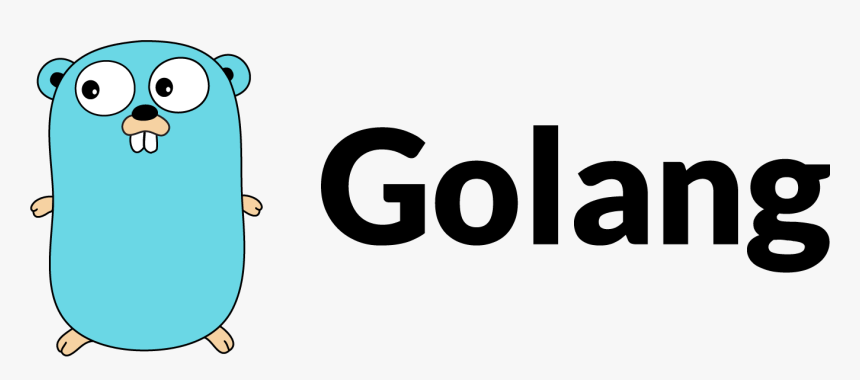

# **FullCycle 3.0 - Docker Go Lang Challenge**


Table of contents
==========
<!--ts-->
   * [Desafio](#desafio)
   * [Requisito](#requisito)
   * [Imagem no dockerhub](#imagem-no-dockerhub)
   * [Imagem local](#imagem-local)
   * [Executando a imagem](#executando-a-imagem)

<!--te-->

## Desafio:
Publicar uma imagem no docker hub. Quando executarmos:

```
docker run <seu-user>/fullcycle
```

Temos que ter o seguinte resultado: 
```
Full Cycle Rocks!!
```
### Requisito:
A imagem de nosso projeto Go precisa ter menos de 2MB.


### Imagem no dockerhub
- https://hub.docker.com/r/jorgegabriel/fullcycle/tags

### Imagem local


### Executando a imagem
```
docker run jorgegabriel/fullcycle
```


